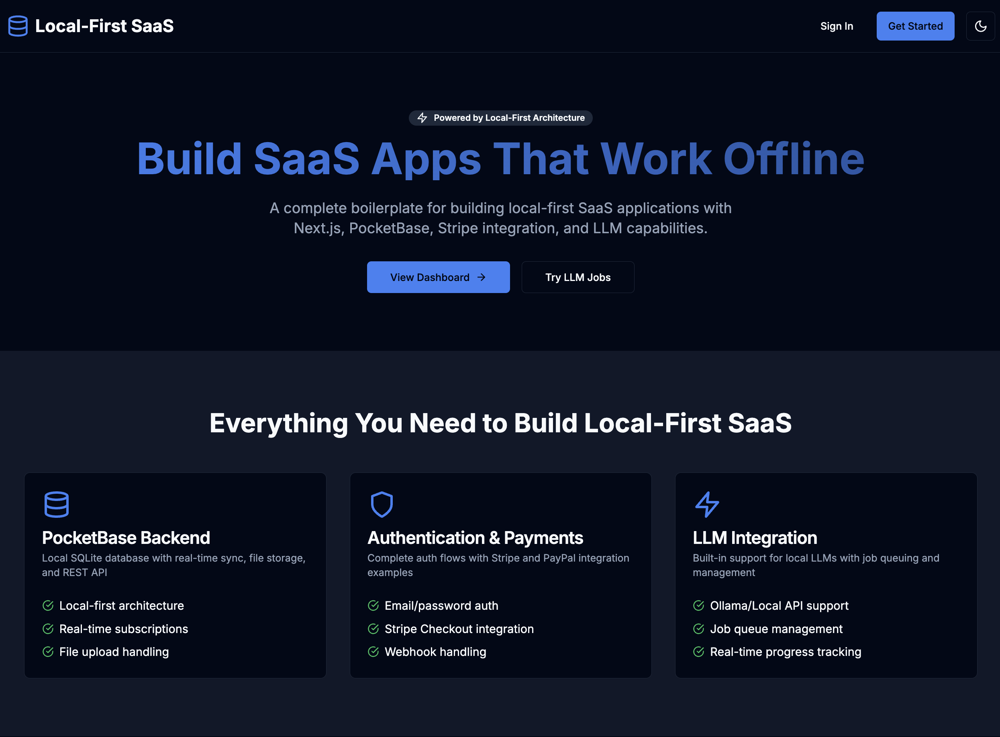
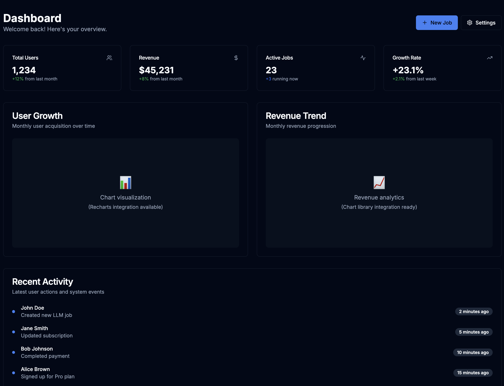
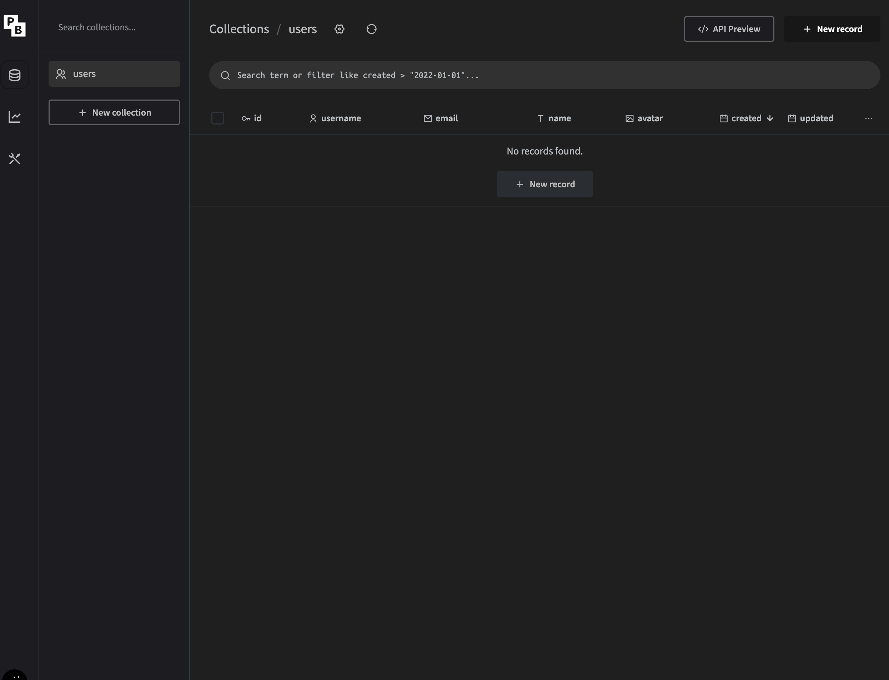

# Local-First SaaS Boilerplate

A complete, production-ready boilerplate for building local-first SaaS applications with Next.js, PocketBase, Stripe integration, and LLM capabilities.









## 🚀 Features

### Core Technologies
- **Next.js 14** with App Router and TypeScript
- **PocketBase** for local-first backend with SQLite
- **Tailwind CSS** with shadcn/ui components
- **Stripe** integration for payments
- **LLM Integration** with support for OpenAI, Ollama, and mock providers

### Key Features
- 🔐 **Authentication** - Email/password with PocketBase
- 💳 **Payments** - Stripe Checkout integration
- 🤖 **LLM Jobs** - Queue and manage AI tasks
- 📊 **Dashboard** - Analytics and metrics
- 🎨 **Dark Mode** - Theme switching with persistence
- 📱 **Responsive** - Mobile-first design
- ♿ **Accessible** - WCAG compliant components
- 🧪 **Type Safe** - Full TypeScript coverage

## 🛠️ Quick Start

### Prerequisites
- Node.js 18+
- npm or yarn
- curl (for PocketBase setup)

### 1. Clone and Install

```bash
git clone <your-repo-url>
cd local-first-saas-boilerplate
npm install
```

### 2. Set Up PocketBase

```bash
# Download PocketBase binary
./scripts/init-pb.sh

# First-time setup (creates admin user and collections)
./scripts/setup-first-time.sh
```

### 3. Configure Environment

```bash
# Copy the example environment file
cp .env.example .env

# Edit .env with your API keys
# Required: STRIPE_PUBLISHABLE_KEY, STRIPE_SECRET_KEY
# Optional: OPENAI_API_KEY, NGROK_TOKEN, etc.
```

### 4. Start Development Environment

```bash
# Start both PocketBase and Next.js
./scripts/start-local.sh
```

### 5. Access the Application

- **Frontend**: http://localhost:3000
- **PocketBase Admin**: http://localhost:8090/_/
- **API Health**: http://localhost:8090/api/health

## 📁 Project Structure

```
├── app/                    # Next.js App Router
│   ├── globals.css        # Global styles and CSS variables
│   ├── layout.tsx         # Root layout with theme provider
│   └── page.tsx           # Marketing landing page
├── components/            # Reusable UI components
│   ├── ui/               # shadcn/ui components
│   └── theme-*           # Theme-related components
├── lib/                  # Core libraries and utilities
│   ├── pocketbase.ts     # PocketBase client wrapper
│   ├── llm.ts           # LLM integration service
│   └── utils.ts         # Utility functions
├── scripts/             # Development and setup scripts
│   ├── init-pb.sh       # PocketBase download and setup
│   ├── bootstrap-collections.sh  # Database schema setup
│   └── start-local.sh   # Development server startup
├── pocketbase/          # PocketBase binary (auto-downloaded)
├── pb_data/            # SQLite database and files (gitignored)
└── examples/           # Integration examples
    ├── stripe/         # Stripe webhook and checkout examples
    └── paypal/         # PayPal client-side integration
```

## 🔧 Configuration

### Environment Variables

| Variable | Description | Required |
|----------|-------------|----------|
| `NEXT_PUBLIC_POCKETBASE_URL` | PocketBase server URL | Yes |
| `NEXT_PUBLIC_STRIPE_PUBLISHABLE_KEY` | Stripe publishable key | Yes |
| `STRIPE_SECRET_KEY` | Stripe secret key | Yes |
| `OPENAI_API_KEY` | OpenAI API key for LLM features | No |
| `NGROK_TOKEN` | ngrok auth token for webhooks | No |

### PocketBase Setup

PocketBase is automatically downloaded and configured for your platform:

```bash
# Initialize PocketBase (downloads correct binary)
./scripts/init-pb.sh

# Bootstrap collections and demo data
./scripts/bootstrap-collections.sh
```

**Collections Created:**
- `users` - User accounts and profiles
- `subscriptions` - Stripe subscription management
- `llm_jobs` - AI task queue and results
- `invoices` - Billing and invoice history

## 💳 Payments Integration

### Stripe Setup

1. **Create Stripe Account**: https://stripe.com
2. **Get API Keys**: Dashboard → Developers → API Keys
3. **Configure Webhooks**: Add endpoint for subscription events

```bash
# Example webhook endpoint (requires ngrok for local dev)
ngrok http 3000

# Update .env with webhook secret
STRIPE_WEBHOOK_SECRET=whsec_...
```

### PayPal Setup (Alternative)

1. **Create PayPal App**: https://developer.paypal.com/
2. **Get Client Credentials**: App Settings → Credentials
3. **Configure for Sandbox**: Use sandbox credentials for testing

## 🤖 LLM Integration

### Supported Providers

- **Mock Provider** (default) - For development and testing
- **OpenAI** - GPT-4, GPT-3.5-turbo
- **Ollama** - Local LLMs (Llama 2, Code Llama, etc.)

### Configuration

```typescript
import { createLLMService } from '@/lib/llm'

// Mock provider (default)
const llm = createLLMService({ provider: 'mock' })

// OpenAI provider
const llm = createLLMService({
  provider: 'openai',
  apiKey: process.env.OPENAI_API_KEY,
  defaultModel: 'gpt-4'
})

// Ollama provider
const llm = createLLMService({
  provider: 'ollama',
  baseUrl: 'http://localhost:11434',
  defaultModel: 'llama2'
})
```

### Usage Example

```typescript
// Submit a job
const jobId = await llm.submitJob('Explain quantum computing', {
  model: 'gpt-4',
  maxTokens: 500,
  temperature: 0.7
})

// Get job status
const job = await llm.getJob(jobId)
console.log(job.status, job.output)
```

## 🎨 Theming

The boilerplate includes a complete design system with:

- **CSS Variables** for consistent theming
- **Dark Mode** support with system preference detection
- **shadcn/ui** components with Radix UI primitives
- **Tailwind CSS** with custom design tokens

### Customization

Edit `app/globals.css` to customize the design system:

```css
:root {
  --primary: 221.2 83.2% 53.3%;
  --secondary: 210 40% 96%;
  /* Add your custom variables */
}
```

## 🚀 Deployment

### Frontend Deployment (Netlify)

1. **Build the application**:
   ```bash
   npm run build
   ```

2. **Deploy to Netlify**:
   - Connect your repository to Netlify
   - Set build command: `npm run build`
   - Set publish directory: `.next`
   - Add environment variables in Netlify dashboard

3. **Configure redirects** (add to `netlify.toml`):
   ```toml
   [build]
     command = "npm run build"
     publish = ".next"

   [[redirects]]
     from = "/api/pocketbase/*"
     to = "http://localhost:8090/:splat"
     status = 200
   ```

### Backend Deployment

**Important**: PocketBase is designed for local-first development. For production:

- **Single User**: PocketBase works great for single-user scenarios
- **Multi-tenant**: Consider migrating to PostgreSQL with a traditional backend
- **Scaling**: Use PocketBase Cloud or self-host with proper backups

## 🧪 Development

### Available Scripts

```bash
# Development
npm run dev              # Start Next.js dev server
npm run build           # Build for production
npm run start           # Start production server

# Code Quality
npm run lint            # Run ESLint
npm run lint:fix        # Fix ESLint issues
npm run type-check      # Run TypeScript checks

# Testing
npm run test            # Run tests
npm run test:watch      # Watch mode
```

### Development Workflow

1. **Start the stack**: `./scripts/start-local.sh`
2. **Make changes** to components and pages
3. **Test changes** at http://localhost:3000
4. **Check PocketBase** at http://localhost:8090/_/
5. **View logs**: `tail -f pb_data/pocketbase.log`

## 🔒 Security Considerations

### Environment Variables
- Never commit `.env` files
- Use different keys for development and production
- Rotate keys regularly

### PocketBase Security
- Change default admin credentials
- Use strong passwords
- Configure proper CORS settings for production

### Stripe Webhooks
- Verify webhook signatures
- Use ngrok for local development
- Set up proper error handling

## 🐛 Troubleshooting

### Common Issues

**PocketBase not starting:**
```bash
# Check if binary exists
ls -la pocketbase/

# Check logs
tail -f pb_data/pocketbase.log

# Manual start
cd pocketbase && ./pocketbase serve --http="localhost:8090"
```

**Collections not found:**
```bash
# Re-run bootstrap script
./scripts/bootstrap-collections.sh
```

**LLM jobs failing:**
```bash
# Check if using mock provider
# Set OPENAI_API_KEY for real LLM integration
```

**Build errors:**
```bash
# Clear Next.js cache
rm -rf .next

# Reinstall dependencies
rm -rf node_modules package-lock.json
npm install
```

## 📚 API Reference

### PocketBase Client

```typescript
import { pb } from '@/lib/pocketbase'

// Authentication
await pb.signUp('user@example.com', 'password', 'User Name')
await pb.signIn('user@example.com', 'password')
await pb.signOut()

// CRUD operations
const users = await pb.collection('users').getList()
const user = await pb.collection('users').getOne('USER_ID')
```

### LLM Service

```typescript
import { llmService } from '@/lib/llm'

// Submit job
const jobId = await llmService.submitJob('Your prompt here')

// Get results
const job = await llmService.getJob(jobId)
```

## 🤝 Contributing

1. Fork the repository
2. Create a feature branch: `git checkout -b feature-name`
3. Make your changes
4. Add tests if applicable
5. Run the test suite: `npm run test`
6. Submit a pull request

### Development Guidelines

- Use TypeScript for all new code
- Follow the existing code style
- Add proper error handling
- Update documentation for new features
- Test on both light and dark themes

## 📄 License

MIT License - see [LICENSE](LICENSE) file for details.

## 🙏 Acknowledgments

- [Next.js](https://nextjs.org/) - React framework
- [PocketBase](https://pocketbase.io/) - Backend as a service
- [Tailwind CSS](https://tailwindcss.com/) - Utility-first CSS
- [shadcn/ui](https://ui.shadcn.com/) - UI components
- [Stripe](https://stripe.com/) - Payment processing
- [Vercel](https://vercel.com/) - Deployment platform

## 📞 Support

- **Documentation**: Check this README and inline code comments
- **Issues**: Create GitHub issues for bugs and feature requests
- **Discussions**: Use GitHub Discussions for questions

---

**⚠️ Important Notes:**

1. **PocketBase Production**: This setup is ideal for local-first development. For multi-tenant production applications, consider migrating to a traditional backend with PostgreSQL.

2. **Stripe Webhooks**: Local development requires ngrok or similar tunneling service for webhook testing.

3. **LLM Costs**: Monitor API usage and costs when using external LLM providers in production.

4. **Data Persistence**: PocketBase data is stored locally. Implement proper backup strategies for production use.
